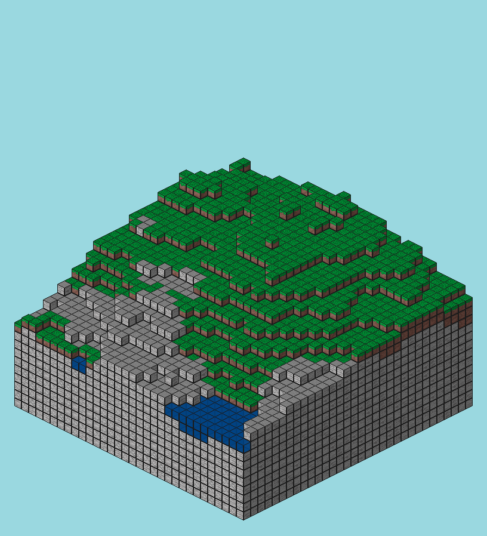

# cubeglobe

**cubeglobe** is a library which produces isometric renders of randomly generated landscapes consisting of blocks. These renders serve no purpose beyond (hopefully) looking cool. 

This library is used by a Fediverse bot, [cubeglobe-bot](https://github.com/DeeUnderscore/cubeglobe-bot) which automatically generates these renders at regular intervals.

## Example
Slightly modified from [`examples/tergentwo.rs`](examples/tergentwo.rs): 

```rust
    let config_toml = std::fs::read_to_string("assets/full-tiles.toml").unwrap();
    let rconfig = Renderer::from_str(config_toml).unwrap();

    let iso_map = TerGenTwo::new()
        .set_len(32)
        .set_frequency(0.01)
        .set_layer_height(7)
        .set_max_water_level(15)
        .set_min_soil_cutoff(30)
        .generate();

    rconfig.render_map(&iso_map).unwrap().save_bmp("example.bmp").unwrap()
```

### Output


## License
The source code of this library is available under the [ISC license](LICENSE). The graphical assets in the `assets` directory are available under [CC-BY](http://creativecommons.org/licenses/by/3.0/). 

If you use this library to create something interesting which you later publish, you are invited to link back to the [Github repository](https://github.com/DeeUnderscore/cubeglobe). This is, however, not a license requirement, unless you use the bundled assets. 
